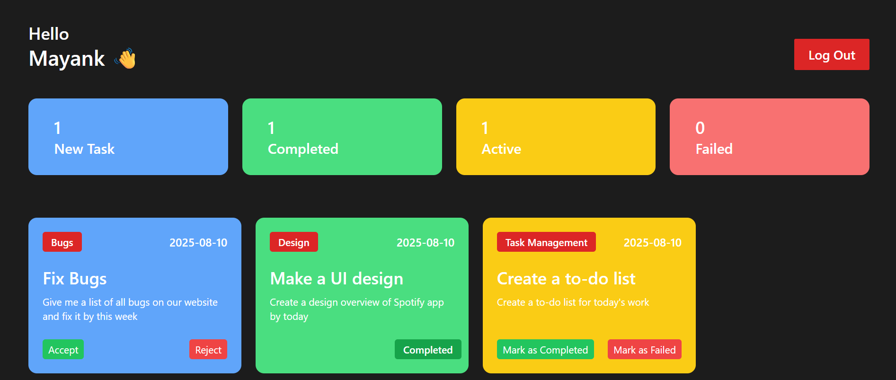

👨‍💼 Employee Management System

A React.js-based Employee Management System that uses LocalStorage for data handling.  
Admins can assign tasks to employees, track their progress in real time, and manage statuses.  
Employees can view assigned tasks and update them as Completed, Failed, or Accepted — with all changes instantly reflected in the admin panel.

🚀 Features
- Admin Panel
  - Assign tasks to employees.  
  - Track task status updates in real time.  
  - View and manage all tasks in one place.  

- Employee Panel
  - View assigned tasks.  
  - Update task status as **Completed**, **Failed**, or **Accepted**.  
  - Instant updates reflected for the admin.

- LocalStorage Integration  
  - All data is stored locally in the browser.  
  - No backend or database required.  

🛠️ Tech Stack
- React.js – Frontend framework  
- LocalStorage – Browser-based data storage  
- CSS / Tailwind – UI styling  

 📸 Screenshots
Example:  

  

